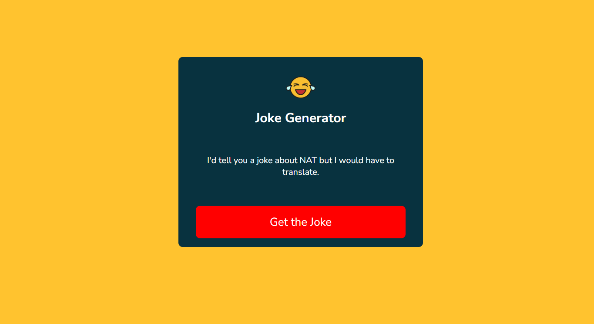

# 😂 Random Joke Generator

This is a simple and fun **JavaScript project for beginners** — a **Random Joke Generator** that fetches hilarious programming jokes from an API and displays them with a click.

It’s perfect for anyone who’s just starting with **HTML, CSS, and JavaScript**, and wants to understand how APIs work in real-world projects.

---


## 📸 Screenshot

  


---

## 🧠 What You’ll Learn

- Working with **JavaScript fetch API**
- Making **GET requests** to external APIs
- **DOM manipulation** (changing content dynamically)
- Building a small project with **clean structure**
- Styling a page with **basic CSS**

---

## 🧰 Tech Stack

- HTML
- CSS
- JavaScript
- [JokeAPI](https://v2.jokeapi.dev/joke/Programming?type=single)

---

## 🔗 API Used

We used this public Joke API:  
**https://v2.jokeapi.dev/joke/Programming?type=single**  
It returns one random programming joke at a time in plain text format.

Example Response:
```json
{
  "category": "Programming",
  "type": "single",
  "joke": "Your momma is so fat you need to switch to NTFS to store a picture of her."
}
